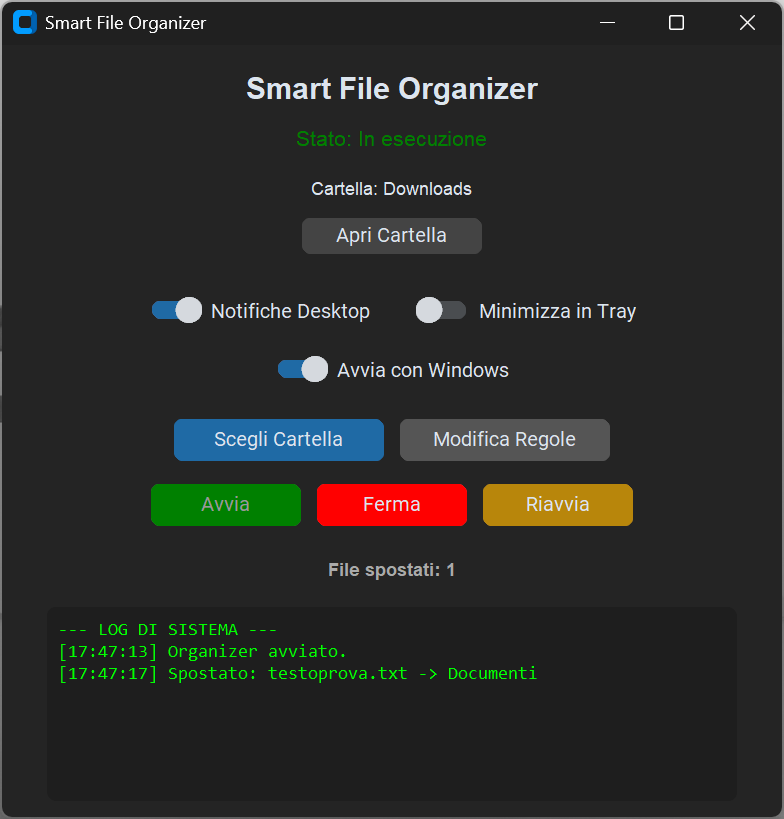
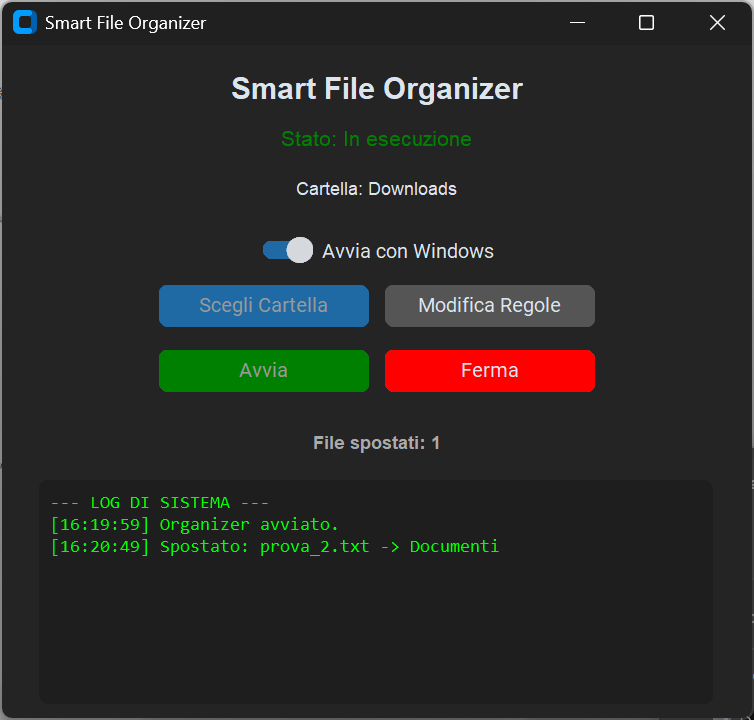
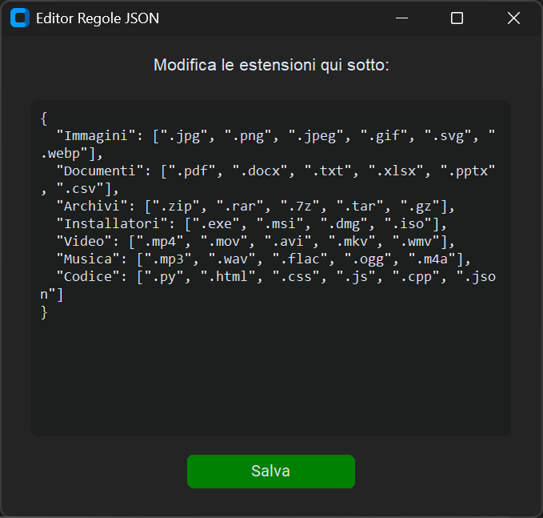

# Smart File Organizer (v2.0.0)

  

## English

A Python-based desktop application that automatically monitors a selected folder and organizes incoming files into specific subfolders based on their extensions.

### Key Features

* **Graphical User Interface (GUI)**: Clean and modern dark mode interface to control the script without using the terminal.
* **Custom Folder Selection**: Choose any folder on your computer to monitor (Downloads, Desktop, etc.).
* **Smart Conflict Handling**: If a downloaded file already exists, the program intelligently renames it (e.g., `file_1.pdf`) to prevent data loss.
* **Live Terminal & Stats**: Real-time visual feedback of moved files and a session counter directly in the app.

  

* **Integrated Rule Editor**: Modify the sorting rules (JSON format) through a dedicated window inside the application. No need to open external text editors.

  

* **Run on Startup (Windows Only)**: Toggle option to automatically start the organizer in the background when Windows boots.

### How to Use

#### For Windows Users (Recommended)
1. Go to the [**Releases**](https://github.com/nicoalt21/auto-file-organizer/releases) page on this repository.
2. Download the `SmartOrganizer_v2.0.0_Windows.zip` file.
3. Extract the contents to a folder on your computer.
4. Keep the `.exe` file and the `config.json` in the same directory.
5. Run the executable file.

#### For Mac/Linux Users or Developers
1. Clone this repository.
2. Install the requirements: `pip install -r requirements.txt`.
3. Run the application: `python gui.py`.

---

## Italiano

Un'applicazione desktop basata su Python che monitora automaticamente una cartella selezionata e organizza i file in entrata in sottocartelle specifiche in base alla loro estensione.

### Funzionalità Principali

* **Interfaccia Grafica (GUI)**: Interfaccia moderna in dark mode per controllare il programma senza usare il terminale.
* **Selezione Cartella Personalizzata**: Scegli qualsiasi cartella sul tuo computer da monitorare (Download, Desktop, ecc.).
* **Gestione Intelligente Duplicati**: Se un file appena scaricato esiste già, il programma lo rinomina in automatico (es. `file_1.pdf`) per evitare sovrascritture.
* **Terminale Live e Statistiche**: Feedback visivo in tempo reale dei file spostati e contatore della sessione direttamente nell'app.
* **Editor di Regole Integrato**: Modifica le regole di smistamento (formato JSON) tramite una finestra dedicata all'interno dell'applicazione. Non serve aprire editor di testo esterni.
* **Avvio Automatico (Solo Windows)**: Opzione per avviare automaticamente l'organizer in background all'accensione del PC.

### Come Usarlo

#### Per Utenti Windows (Raccomandato)
1. Vai alla pagina [**Releases**](https://github.com/nicoalt21/auto-file-organizer/releases) di questo repository.
2. Scarica il file `SmartOrganizer_v2.0.0_Windows.zip`.
3. Estrai il contenuto in una cartella sul tuo computer.
4. Mantieni il file `.exe` e `config.json` nella stessa cartella.
5. Avvia il file eseguibile.

#### Per Utenti Mac/Linux o Sviluppatori
1. Clona questo repository.
2. Installa i requisiti: `pip install -r requirements.txt`.
3. Avvia l'applicazione: `python gui.py`.
